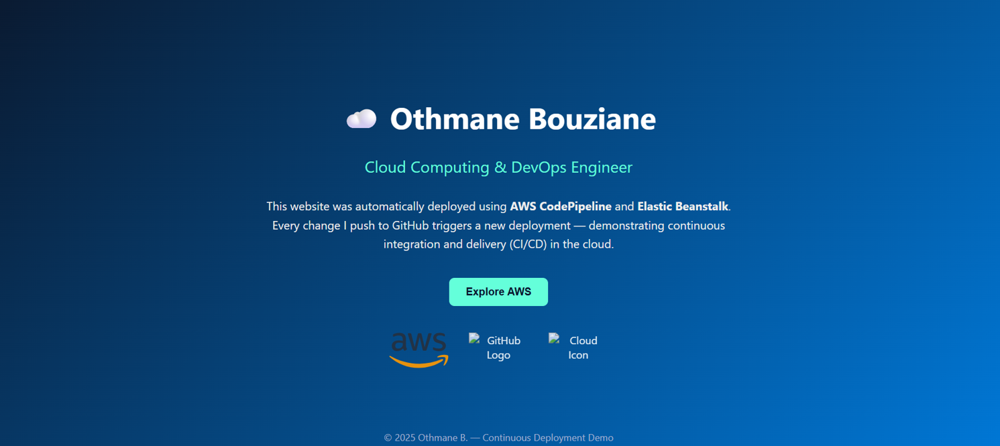
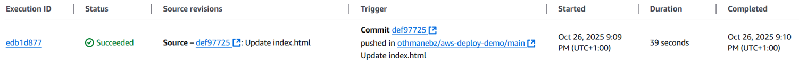
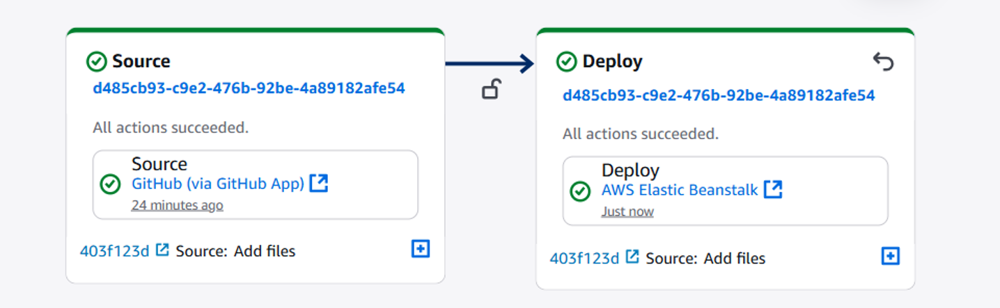
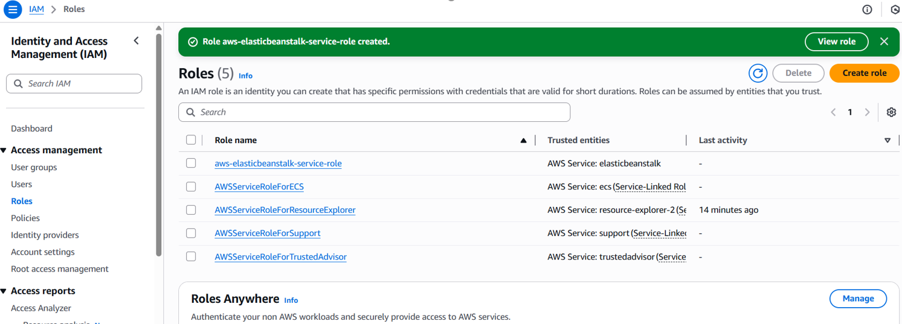
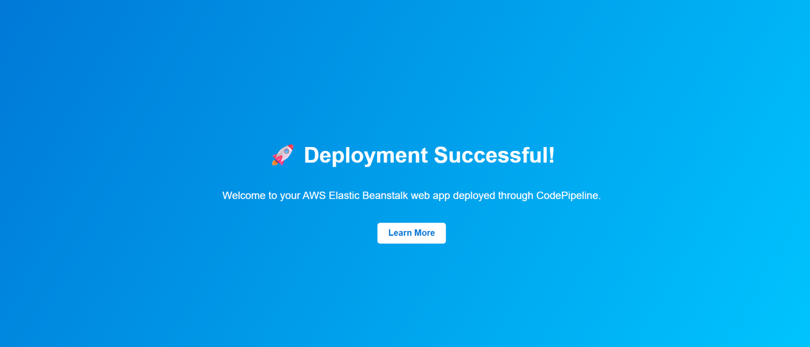

# ☁️ Continuous Deployment with AWS CodePipeline & Elastic Beanstalk

This project demonstrates a **CI/CD (Continuous Integration and Continuous Deployment)** pipeline built entirely with **AWS services**.  
It automatically deploys a web application hosted on **Elastic Beanstalk** every time a change is pushed to this GitHub repository.

---

## 🚀 Project Overview

### 🎯 Goal
To automate the deployment process using **AWS CodePipeline**, connecting **GitHub** as the source and **Elastic Beanstalk** as the deployment target.

Whenever code is updated on GitHub, the pipeline:
1. Detects the new commit.
2. Builds the new version.
3. Deploys it automatically to Elastic Beanstalk.

---

## 🏗️ Architecture

- **GitHub** → Source repository for the web app (index.html).  
- **CodePipeline** → Detects commits and triggers deployments.  
- **Elastic Beanstalk** → Hosts the web app in a managed environment (auto-scaling, load balancing).  
- **IAM Roles** → Grant permissions between AWS services securely.  

---

## ⚙️ Technologies Used

| Layer | Service | Purpose |
|:------|:---------|:---------|
| Source | **GitHub** | Stores source code |
| CI/CD | **AWS CodePipeline** | Automates build and deploy |
| Deployment | **AWS Elastic Beanstalk** | Manages the web app environment |
| Compute | **EC2 Instances** | Hosts the application |
| IAM | **Roles & Policies** | Grants secure access permissions |
| Monitoring | **CloudWatch** | Tracks application logs & health |

---
## 📸 Project Screenshots

### 1️⃣ Elastic Beanstalk Environment
Shows the live application running successfully on AWS Elastic Beanstalk.

---

### 2️⃣ IAM Roles Configuration
IAM roles created for Elastic Beanstalk and EC2 instances.

---

### 3️⃣ CodePipeline Workflow
Pipeline connected to GitHub as source and Elastic Beanstalk as deployment target.

---

### 4️⃣ Successful Pipeline Execution
Automatic deployment triggered by GitHub commit.

---

### 5️⃣ Deployed Web Application
Deployed web app showcasing portfolio and automation.

---

### 6️⃣ Deployment Success Page
Confirmation message that deployment was completed.

## 📂 Project Structure

├── index.html # Web application entry point
├── README.md # Project documentation

---

## 💡 How It Works

1. **Push code to GitHub**
   - Edit and commit your changes to `index.html`.
2. **CodePipeline triggers**
   - AWS detects the new commit.
3. **Automatic deployment**
   - Elastic Beanstalk pulls the new version and redeploys the web app.
4. **Access your site**
   - Visit your environment URL (something like):  
     👉 `http://othmane-env.eba-xyz123.us-east-2.elasticbeanstalk.com`

---

## 🧠 Example Output

When successfully deployed, your page shows:

> “🚀 Continuous Deployment Active!  
> This version was deployed automatically using AWS CodePipeline and Elastic Beanstalk.”

---

## 🔐 IAM Permissions Summary

Make sure your pipeline role has these permissions:
- `elasticbeanstalk:CreateApplicationVersion`
- `elasticbeanstalk:UpdateEnvironment`
- `cloudformation:UpdateStack`
- `s3:GetObject`, `s3:PutObject`
- `iam:PassRole`

---

## 👤 Author

**Othmane Bouziane**  
💼 Cloud Computing & Virtualization Engineer  
📍 Morocco  
🔗 [LinkedIn](https://www.linkedin.com/in/othmanebouziane)  

---

## 🏁 Future Improvements

- Add **CloudWatch Alarms** for monitoring deployment failures.  
- Integrate **AWS CodeBuild** for build/test automation.  
- Add a **Light/Dark mode toggle** on the portfolio site.  
- Extend the pipeline to **multiple environments** (dev, staging, prod).

---

## 🧰 Useful AWS Links

- [AWS CodePipeline Docs](https://docs.aws.amazon.com/codepipeline/latest/userguide/welcome.html)  
- [AWS Elastic Beanstalk Docs](https://docs.aws.amazon.com/elasticbeanstalk/latest/dg/Welcome.html)  
- [AWS Free Tier](https://aws.amazon.com/free)

---

> **Tip:** Keep this project running on the AWS Free Tier and showcase it in your portfolio or LinkedIn — it’s a perfect demonstration of your DevOps skills.
